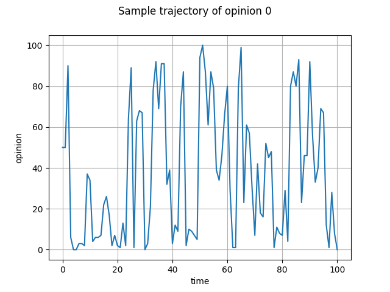

# Noisy voter model with restricted interactions

Python implementation of noisy voter model via Gillespie method with added restrictions. In this model some vertices are omitted from the network of opinions (see graph reference below), meaning certain opinions can't interact directly. Here we only analyse cases with 3 and 4 opinions.

  

## Requirements

- numpy (tested with 2.0.0)
- typer (tested with 0.12.3)
- typing_extensions (tested with 4.12.2)

## Usage of Gillespie method
text
`
import state_3
import numpy as np
import glob
import matplotlib.pyplot as plt

initial_condition = [50, 20, 30]
time_step = 1
n_steps = 100
epsilon = 0.5

state_3.main(epsilon, n_steps, time_step, initial_condition)

name = ""
for pathname in glob.glob(r"3_data_0.5*.txt"):
    name = pathname

data = np.genfromtxt(name, delimiter=',')

opinion_0 = [item[0] for item in data]

time = list(range(len(opinion_0)))

plt.figure()
plt.suptitle("Sample trajectory of opinion 0")
plt.xlabel("time")
plt.ylabel("opinion")
plt.plot(time, opinion_0)
plt.grid()
plt.show()
`
Using this code one should get similar figure as below.

  

## Acknowledgements

This code was written as a part of summer internship project "Influence of the state interaction network on the statistical properties of the voter model". Internship was supported by [Research Council of Lithuania](https://lmt.lrv.lt) (P-SV-24-28). Internship was supervised by [Aleksejus Kononovicius](https://kononovicius.lt).
