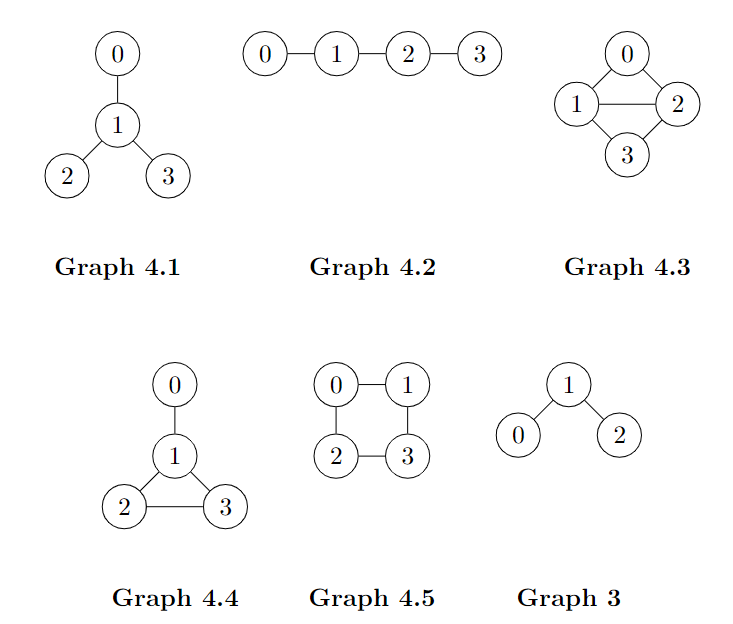

# Noisy voter model with restricted interactions

Python implementation of noisy voter model via Gillespie method with added restrictions. In this model some vertices are omitted from the network of opinions (see graph_reference.png), meaning certain opinions can't interact directly. Here we only analyse cases with 3 and 4 opinions.

  

